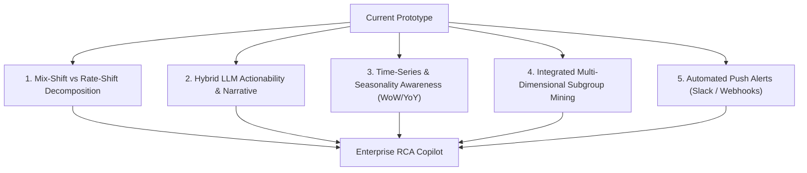

# Autonomous Metric RCA & Variance Copilot - Architectural Rules & Enterprise Roadmap

## Tech Stack
- Runtime: Python 3.11+
- OLAP Engine: DuckDB (in-memory / local `.duckdb`), with connectors for BigQuery/Snowflake pushdown
- Agent Orchestration: LangGraph (`StateGraph`), Pydantic v2
- Statistical Engine: Scikit-learn (`DecisionTreeClassifier`), NumPy, SciPy (Mix-Shift / Rate-Shift decomposition & Tree Mining)
- Reasoning & Narrative: Gemini API / OpenAI (Hybrid LLM Seam for action recommendations)
- Presentation & Alerting: Streamlit, Plotly, Slack Webhooks

## Non-Negotiable Architectural Contracts
1. **Separation of Compute and Reasoning:** 
   - Never use the LLM to calculate arithmetic, aggregate metrics, or perform statistical attribution.
   - All calculations must happen deterministically in DuckDB SQL or dedicated Python statistical modules.
   - LLMs are strictly bounded to executive narrative synthesis and actionable business recommendations using pre-calculated evidence.
2. **Read-Only Database Safety:**
   - The DuckDB connection used by agents must be strictly read-only (`read_only=True` or PRAGMA-enforced).
   - SQL queries must be sanitized; DDL/DML statements (`DROP`, `DELETE`, `INSERT`, `UPDATE`, `ALTER`, `TRUNCATE`) must raise immediate exceptions.
   - Enforce a maximum query timeout and a strict limit on returned rows (`LIMIT 500`).
3. **Typing & Validation:**
   - All agent states, tool arguments, and node outputs must use strict Pydantic v2 models.
   - Every module must have complete type annotations (`typing`).
4. **Code Quality & Testing:**
   - Modular structure: no single file exceeding 250 lines.
   - Self-contained, deterministic unit tests for every mathematical engine component and guardrail.

## Enterprise Architecture Roadmap (5 Core Enhancements)

### 1. Mathematical Upgrade: Mix-Shift vs. Rate-Shift Decomposition (Kitsberger Method)
Decompose total metric variance into 3 deterministic components:
$$\Delta \text{Total Rate} = \underbrace{\sum w_i^B \cdot \Delta r_i}_{\text{Rate Effect (Performance)}} + \underbrace{\sum r_i^B \cdot \Delta w_i}_{\text{Mix Effect (Traffic Shift)}} + \underbrace{\sum \Delta r_i \cdot \Delta w_i}_{\text{Interaction Effect}}$$
- Differentiates between actual performance degradation (Rate Shift) vs changes in traffic composition (Mix Shift / Simpson's Paradox).

### 2. Hybrid LLM Actionability & Executive Narrative
- Feed mathematically validated findings into the LLM adapter to generate:
  - Concise C-suite executive summaries.
  - Actionable diagnostic recommendations (e.g., investigating deployment build spikes or gateway failures).

### 3. Time-Series & Automatic Seasonality Baselines
- Support automated baseline extraction (Week-over-Week, Year-over-Year) to account for weekday/weekend and seasonal noise directly from time-indexed datasets.

### 4. Integrated Multi-Dimensional Subgroup Mining
- Fully integrate Decision Tree leaf mining (`subgroup_miner.py`) into the core investigation node to surface compound segment intersections (e.g. `device=iOS AND app_version=2.4 AND gateway=stripe`).

### 5. Automated Push Alerts & Webhooks
- Support headless execution modes triggered by data pipelines (dbt/Airflow) that push structured alerts directly to Slack, email, or webhooks.

### LLM Verification Rules

- A deterministic fallback is resilience behavior, never evidence that LLM integration succeeded.
- Validate Gemini through the public `generate_actionable_narrative` entrypoint, not only through
   `_generate_with_gemini` or another internal helper.
- A live LLM smoke test must fail when the result is not labeled `[Gemini]`; use
   `scripts/verify_gemini.py` for this check.
- Provider exceptions must be observable in logs or strict verification errors. Do not silently
   report a fallback as a successful provider run.
- Never print, commit, or include API keys in prompts, logs, tests, screenshots, or responses.
- Treat a successful type check, unit test, or fallback response as separate from live provider
   verification. Report each result independently.
